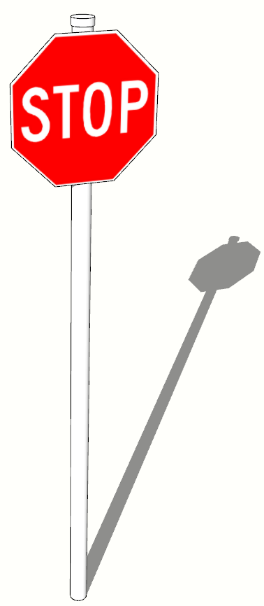
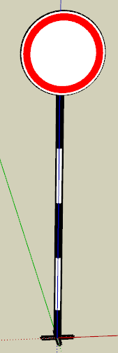
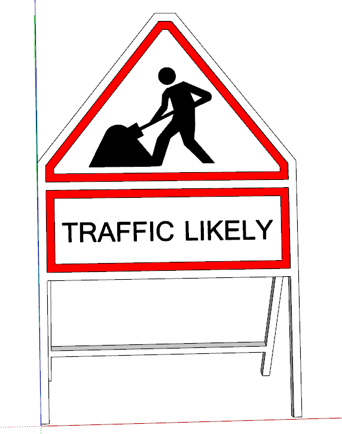
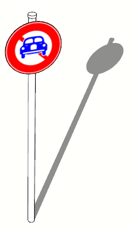
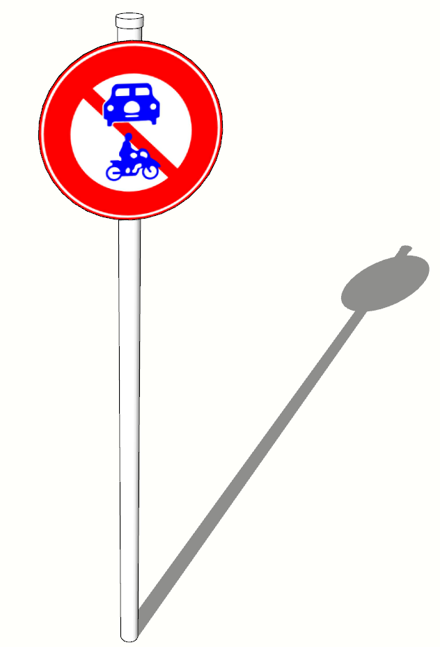
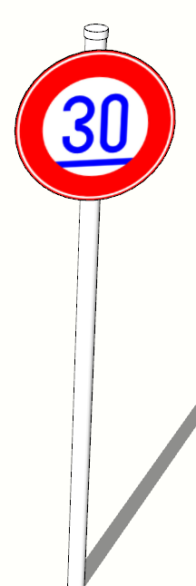
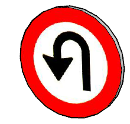

ROAD:
----

- single road (đường 1 chiều):

- double road (đường 2 chiều):

- change_lane (dùng để quay đầu xe):

- corner road (đường cong):

- single_single_3 (ngã 3 1-1, một chiều giao với 1 chiều):

- double_single_3 (ngã 3 2-1):

- double_double_4 (ngã 4 2-2):

- double_single_4 (ngã 4 2-1):

- bonus hill_road (hình dấu ~):

TRAFFIC-SIGN:
------------

- stop (thấy thì dừng xe lại 5->7s r chạy tiếp):

- forbid (biển báo chỉ đường cấm -> quẹo hướng khác):

- contruction (biển báo công trình -> chọn lane khác hoặc quẹo đường khác):

- no_car, no_car_1 (biển báo cấm xe hơi -> chọn lane khác hoặc quẹo đường khác):

- slow_down (biển báo đi chậm lại -> giảm tốc độ):

- turn_back (biển báo quay đầu xe -> quay đầu đi hướng ngược lại, sử dụng trên đường "change_lane"):

